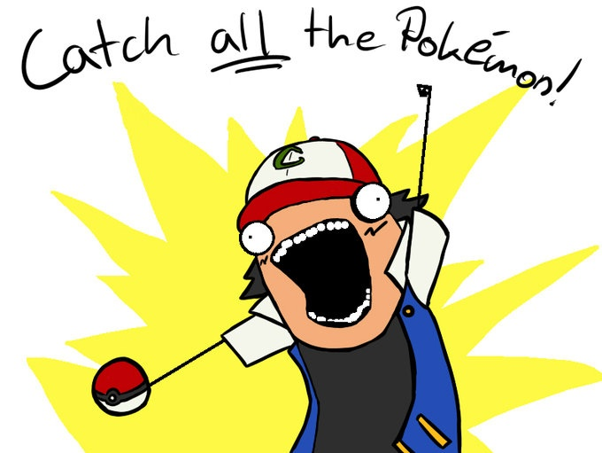
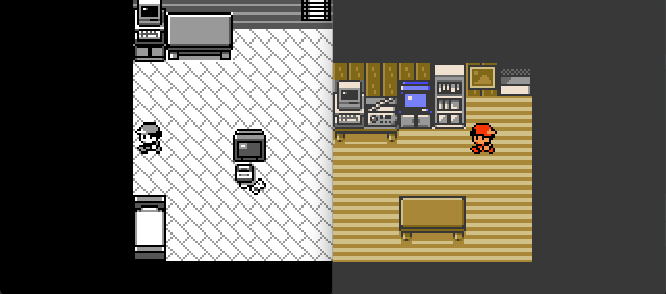

# Reinforcement Learning 201: AI plays ALL the Pokémon

Reinforcement learning (RL) has proven to be a powerful tool in navigating complex environments, from board games to robotics. But what happens when you train an RL model across multiple environments that are functionally similar but visually different - like two different Pokémon games?

In this post, we'll explore the challenges and potential advantages of multi-environment reinforcement learning. Specifically, we'll look at what it means to train an agent that can play and generalize across two visually different Pokémon games that share core mechanics but vary in their graphical representation. In this case I'll be using Pokémon Red and Pokémon Gold.

For this post I will assume you are familiar with the basic concepts of reinforcement learning. If not, I have written an earlier blog here: Reinforcement Learning 101: AI plays Pokémon

## Setup
In short, the setup consists of a RL agent piloting an emulator running a Pokémon game. The agent gets a reward after each button press and slowly learns to navigate the world and fight battles.

What's new is that instead of a single version of Pokémon, it now gets one of two versions: Pokémon Red or Pokémon Gold. It will still use a single model for both of them. The idea is that the model will learn more generic patterns and actually understand the world it's in instead of memorising it.

Since I already had it set up for one version, implementing this was relatively easy. I moved most of the code from the version-specific class to a new class that both the environment for Red and Gold will inherit from. The main difference between the games is where certain values are stored in the memory. These values ended up in the version-specific classes, with the super class using them for determining the gamestate and rewards.

Example code difference for the two environments:

    class RedGymEnv(PokeGymEnv):
        gb_path = '../PokemonRed.gb'
    
        _map_position_x = 0xC106
        _map_position_y = 0xC104
        _map_bank_no = 0xD35D
        _map_map_no = 0xD35E

    class GoldGymEnv(PokeGymEnv):
        gb_path = '../PokemonGold.gbc'
    
        _map_position_x = 0xD20D
        _map_position_y = 0xD20E
        _map_bank_no = 0xDA00
        _map_map_no = 0xDA01

With this setup in place I could get on to the more challenging part of the project: training the model.

## Core Challenges
Training a single model on multiple different games comes with its challenges. I will go over the most important ones and later discuss the strategies you can apply to mitigate these challenges.

### Visual Discrepancy
Even though both Pokémon games generally follow the same rules, visually they're very different. The most obvious difference is that one is black and white, and one has color. The Convolutional Neural Net (CNN) that is used by the agent will need some training before realising game states that look different, are actually very similar. Shown below is an example of such a situation during training.

### Alignment of Action Spaces
In the case of these specific Pokémon games, this is not an issue. Because they were originally played on the same device, the controls are the same. Only when adding the next game, more buttons become available. In later versions a touchpad was added in addition to the existing buttons.

### Training Stability and Sample Efficiency
The agent must see more data to understand what is invariant across the games. This can dramatically increase the number of episodes required to converge on effective strategies This also means it will spend more time in the early stages of the game. If it learns the wrong patterns early on, it can become very confidently incorrect about what it has to do in new situations and get stuck.

### Reward Assignment and Exploration
Since visual cues differ, it may take longer for the agent to recognize the causal relationships between its actions and the resulting rewards. Exploration strategies tuned for one environment might also fail in the other, leading to uneven performance or stagnation in one game. All values used to calculate rewards are taken directly from the emulator memory have to be tailored to the game being played.

## Key Advantages
Using multiple different environments also has its advantages. By adding a whole new class of training data you will end up with a more robust, better generally usable model.

### Improved Generalization
When done right, training across similar but different games forces the agent to come up with higher-level abstractions - like game rules or reward structures - instead of memorizing visuals. This leads to an agent that can generalize better, not just to these two games but potentially to future unseen ones with similar mechanics.

### Robustness to Noise and Style Variations
An agent trained on multiple visual styles is more robust to graphical glitches, modded environments, or even fan-made versions. This is especially useful in the Pokémon community, where ROM hacks and custom versions are common.

### Zero-Shot Transfer Potential
If trained well, such an agent could play a new Pokémon game with no further training - a milestone in zero-shot transfer learning. This is the next step of this project. I will evaluate the models performance by having it play the next generation of Pokémon games without any further training.

### Foundation for Modular or Meta-Learning
Multi-environment training lays the groundwork for more advanced systems, such as meta-RL, where the agent learns how to learn. It also supports modular architectures where perception and decision-making modules can be swapped or specialized per environment.

## Strategies to Mitigate Challenges
The strategies I tried, focused on mitigating the challenge of handling the visual differences.

**Domain Randomization**: Introduce controlled randomness in visual elements during training (color shifts, random noise) to help the model generalize. This does slightly affect speed early on, but will result in a model that can more easily navigate unseen areas of the game.

**Feature-Based Learning**: Extract and use symbolic representations or game states (if available) rather than raw pixels to reduce reliance on visuals. This is a step I already took, by getting all the data for rewards directly from the emulator memory.

**Curriculum Learning**: Start training in a single game and progressively introduce the second one, or vice versa, to ease the adaptation process. This way the CNN model used is trained well on one visual and only has to be modified to also fit the new visuals. All the logic that comes after is already in place.

This worked pretty well for these Pokémon games, albeit only in a specific order. Training on the black and white visuals first worked, training on the color version first had no discernible benifit. As you can imagine, learning to look for red doors to enter and exit houses has no use when transfering to a black and white environment.

**Shared Encoders with Environment Tags**: Use a shared neural encoder with a small conditioning signal that indicates which game is currently being played. Adding 5 pixels to the top of the input of which you color either the left or right half white can serve as a trigger to handle the rest of the input differently. This trigger can serve as a signal to the system that certain action in the action space are off-limits. With this, you can bridge the gap between game-specific action spaces. Adding support for a touchpad as discussed earlier would then be possible.

**Reward Scaling**: Since the games are similar, writing a completely different reward function per game does not make a lot of sense. Instead what I did was slightly modify the rewards so they match the games. For example, if one game has a bigger area to explore, you may want to use a slightly higher reward for reaching unseen squares.

## Conclusion
Training an RL agent across two visually different but mechanically similar Pokémon games is both a technical challenge and an exciting opportunity. It pushes the boundaries of generalization, robustness, and adaptability in reinforcement learning.

By tackling the visual domain gap and building abstraction into our agents, we get closer to AI systems that don't just memorize games - but truly understand how to play them.